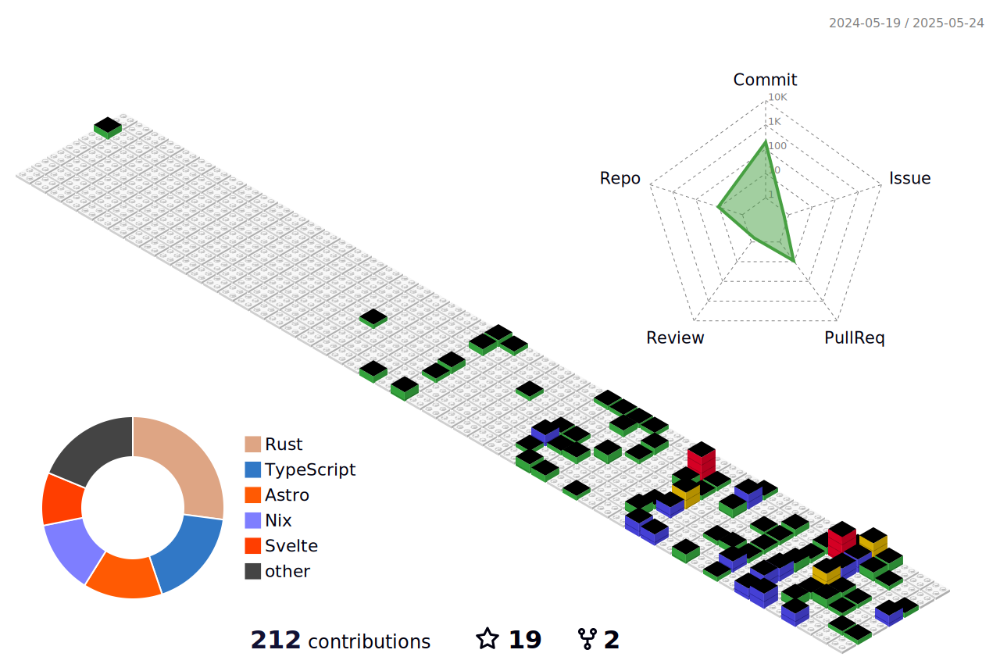

<h2 align="center">Hi there 👋</h2>

<h2>Things I code with</h2>
 
 
<h5 align="center">
  
  
  
  
  
  
  
  
  
   
  
  
  
  
  
</h5>
 
 
<table align="center">
  <thead align="center">
    <tr border: none;>
      <td><b>🎁 Projects</b></td>
      <td><b>⭐ Stars</b></td>
      <td><b>📚 Forks</b></td>
      <td><b>🛎 Issues</b></td>
      <td><b>📬 Pull requests</b></td>
    </tr>
  </thead>
  <tbody>
    <tr>
      <td><a href="https://github.com/mingeme/mingeme"><b>mingeme</b></a></td>
      <td></td>
      <td></td>
      <td></td>
      <td></td>
    </tr>
    <tr>
      <td><a href="https://github.com/mingeme/imgood"><b>imgood</b></a></td>
      <td></td>
      <td></td>
      <td></td>
      <td></td>
    </tr>
    
  </tbody>
</table>
 
 

<picture>
  <source media="(prefers-color-scheme: dark)" srcset="https://raw.githubusercontent.com/mingeme/mingeme/output/github-contribution-grid-snake-dark.svg">
  <source media="(prefers-color-scheme: light)" srcset="https://raw.githubusercontent.com/mingeme/mingeme/output/github-contribution-grid-snake.svg">
  
</picture>

